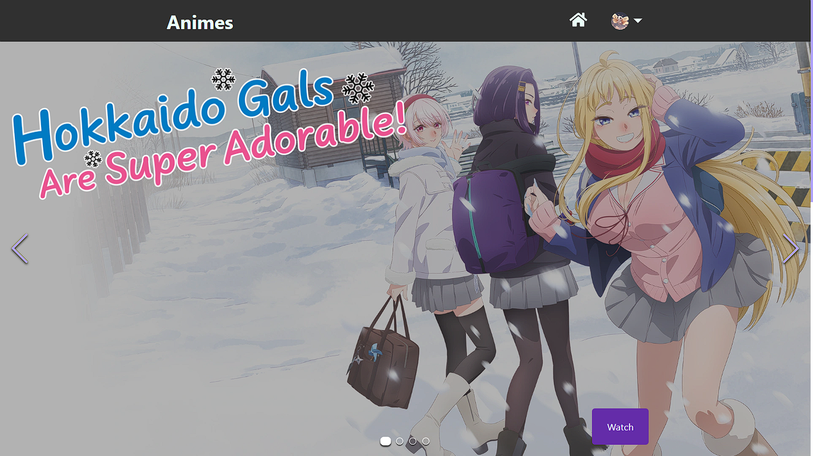
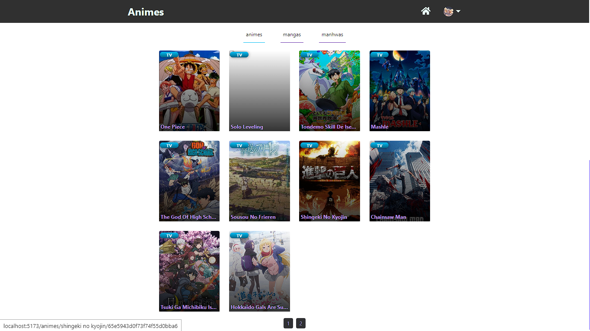
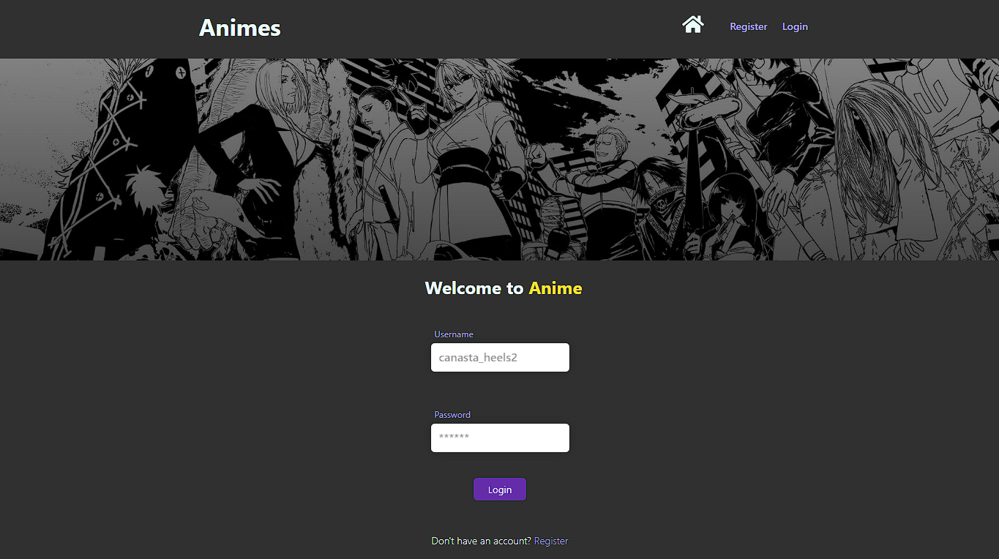
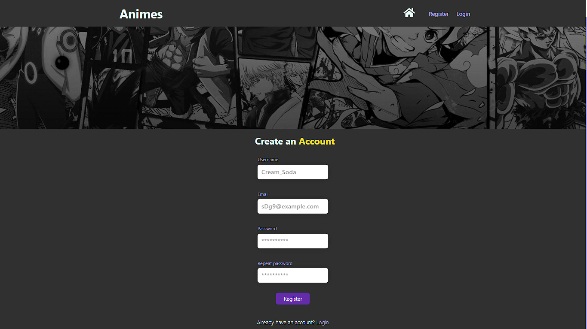
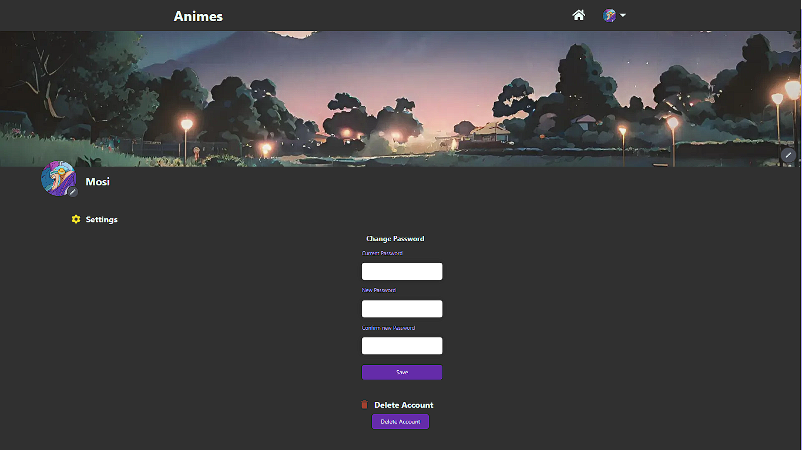
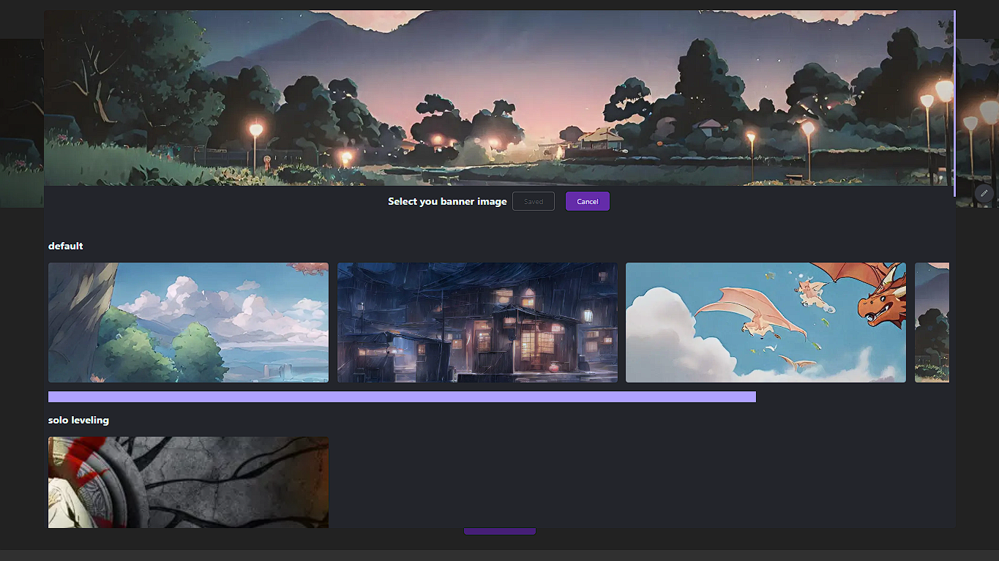
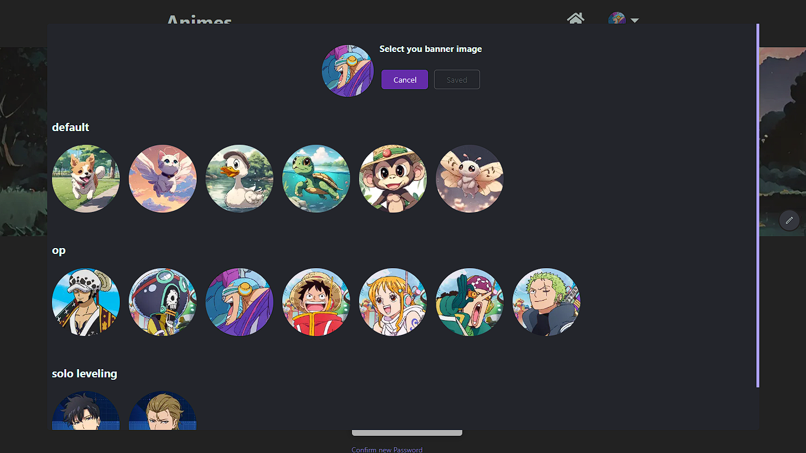
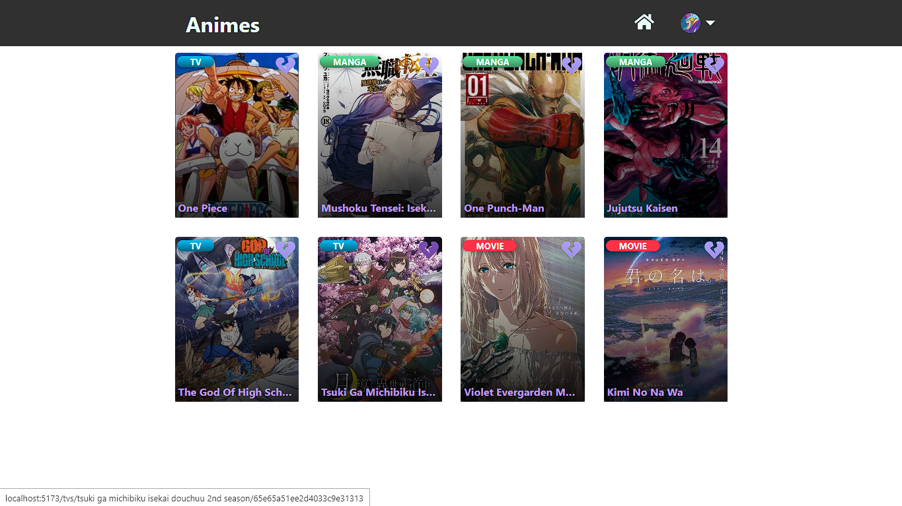
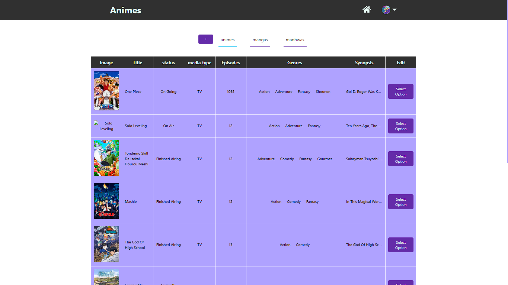
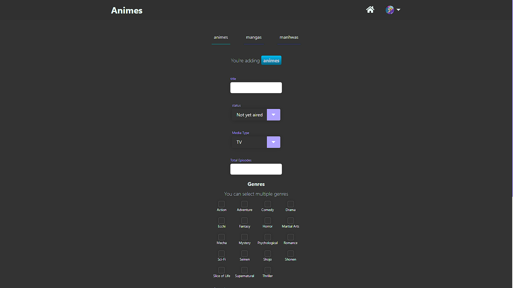

## Tech Stack

**Client:** React, CSS , HTML

**Server:** Python, FastAPI, MongoDB

## 
## Environment Variables

To run this project, you will need to add the following environment variables to your .env file


`MONGO_PWD = your db password` 

`MONGO_USER = your user ` 

`SECRET_KEY = a ssh key or key`

`ALGORITHM = a sequence of number,letter and symbols`

`ACCESS_TOKEN_EXPIRES_MINUTES = a number` 

## Run Locally

Clone the project

```bash
  git clone https://github.com/zyperr/fullstack-anime-page.git
```

Go to the project directory

```bash
  cd fullstack-anime-page
```


## Installation


##### Frontend dependencies 
```bash
  cd .\client\
  npm install
```
#### Backend dependencies
 
Make sure to create a Virtual Environments before installing packages

```bash
    cd .\backend\
    python -m venv env
```
*Windows*
```bash
    \fullstack-anime-page\backend> .\env\Scripts\activate
```
*Linux*

```bash
    source env/bin/activate
```
*install packages*
```bash
    pip install -r requirements.txt
```
# fullstack-anime-page

#### 👽 User
An anime page *(yes another)* where you can visualize animes,mangas and manhwas with their synopsis, number of episodes and if they've had finished or have not.

You can register or sign in.If you have succefully create and sign in then you can customize your profile banner and avatar moreover you're able to modify your password or delete your account.

Of course if you like to add some animes as favorites you could do this only if you've had succefully sign in.

#### 🔒 Admin 

Admin can will be able to modify an existing anime/manga or manhwa,certainly Admin have their own page for this and it only can be accessed if you're and administrador besides they can create animes/mangas and manhwas.
## 💻 Frontend
## Color Reference

| Color             | Hex                                                                |
| ----------------- | ------------------------------------------------------------------ |
| Backgrounds |  #303030 |
| Text - Hover - Backgrounds items |  #afa2ff |
| Details |  #f6e528 |
| Background - Text  |  #EAFDF8 |
| Details for Text  |  #bb93eb |


### Screenshots

#### Home








#### Login 





#### Register




#### Profile







#### Favorites




### 🔒 Admin







## Authors

- [@zyperr](https://github.com/zyperr)
- [@Irumau](https://github.com/Irumau)

